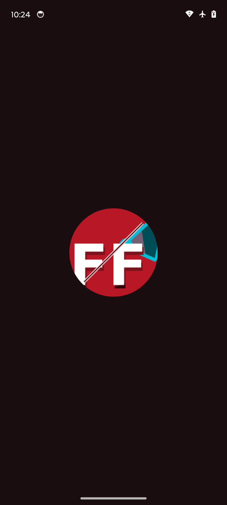
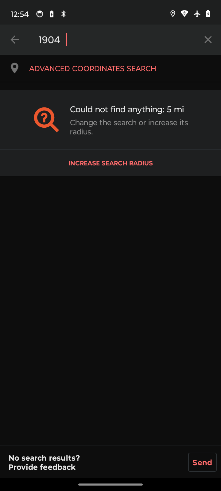
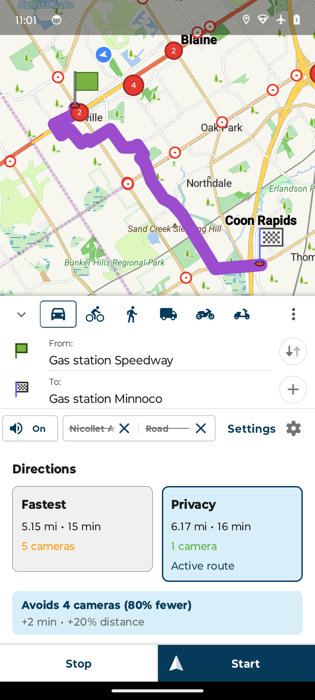
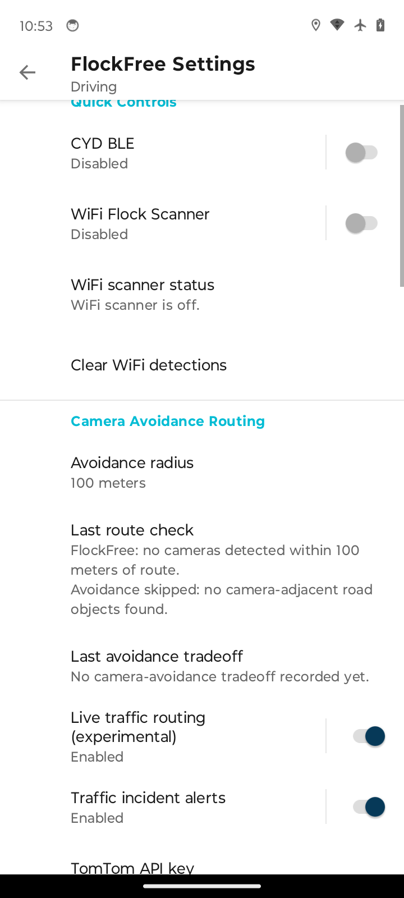
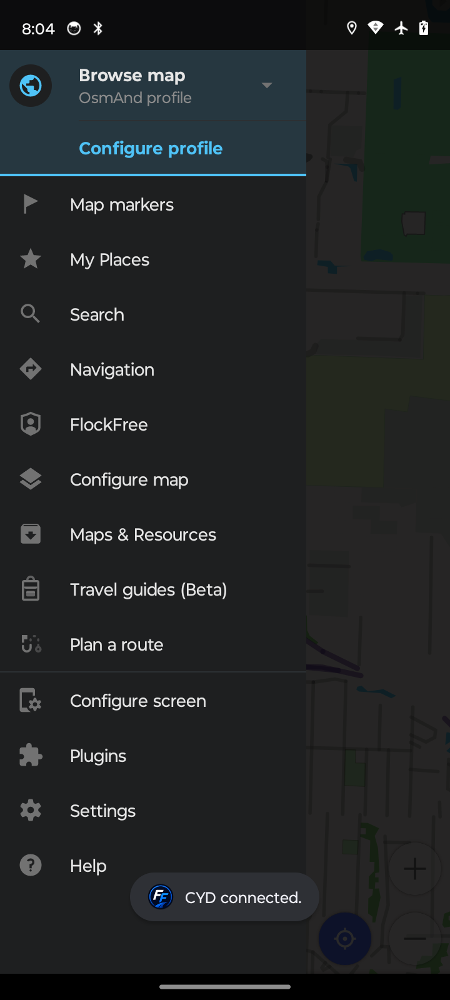
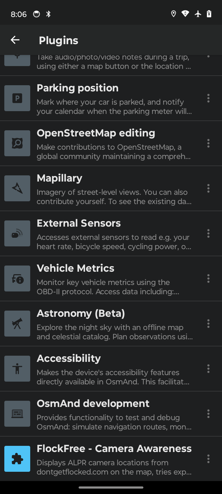

# FlockFree Navigation

FlockFree Navigation is an OsmAnd fork with an in-tree FlockFree plugin for Flock camera awareness, optional CYD companion hardware integration, traffic-aware routing with user-provided TomTom keys, and community reporting.



## Features

### Camera Awareness
- **89,942-camera Flock index** — Bundled public-camera source snapshot filtered to Flock-labeled records, stored in SQLite for fast spatial queries
- **Camera orientation cones** — Translucent view cones rendered on the map at zoom 15+ showing camera heading
- **Rotation-stable camera markers** — Camera points use the OpenGL elevated projection path and refresh during rotate, pan, and zoom animations to prevent delayed marker jumps
- **Nearby Flock camera alerts** — Toast overlay with vibration when approaching known Flock cameras; distance updates live as you approach and the alert persists until you've passed the camera. When navigating, only cameras on your route trigger alerts
- **WiFi Flock detection** — Passively scans for Flock Safety camera WiFi beacons and triggers alerts + CYD auto-pause when detected
- **Nearest Flock camera inspection** — Map-center query to find the closest Flock camera within 5,000m



### Optional CYD (Cheap Yellow Display) Companion Hardware Running Flock You
- **Optional hardware add-on** — FlockFree works as a standalone navigation app; CYD hardware is only needed for field RF detections
- https://github.com/yetisoldier/CYD-Flock-You (Flock You CYD firmware)
- **BLE foreground service** — `CydBleService` runs as `connectedDevice` type, survives backgrounding
- **Global BLE setting** — CYD BLE toggle is global across all OsmAnd profiles
- **Phone GPS streaming** — Streams phone GPS to CYD hardware via `FYGPS` BLE UART
- **Detection review workflow** — CYD detections appear as map markers for manual review before submission
- **Simulate mode** — `FYSIM` support for bench testing without live RF
- **Auto-pause on Flock detection** — When WiFi Flock detection triggers, the CYD companion is automatically paused

### Route Avoidance
- **Wide corridor road blocking** — For each Flock camera within the route corridor radius (default 100m), blocks ALL route segments within the radius, not just the single nearest road. This prevents the router from using adjacent roads in the same corridor and still passing near cameras.
- **Iterative relaxation avoidance** — If full avoidance fails (no route exists with all roads blocked), progressively unblocks the least-camera-impactful roads (up to 4 iterations) until a viable route is found.
- **Camera count validation** — Only accepts an avoidance route if it has strictly fewer Flock cameras than the original route. Prevents the inverted "privacy route has more cameras" bug.
- **Detour guardrails** — Non-zero-camera privacy routes must stay within the greater of 10 minutes or 20 percent extra time, plus 25 percent extra distance; zero-camera routes are always accepted.
- **Route comparison/status card** — Shows fastest vs privacy route side-by-side when a privacy route is accepted, or shows the FlockFree route-check status when no separate privacy route is available.
- **Partial avoidance reporting** — When full avoidance isn't possible, reports how many Flock camera roads were blocked and how many Flock cameras remain on the route.
- **Status persistence** — Route check results persist across app restarts
- **Metadata scope note** — FlockFree only avoids cameras whose source metadata identifies them as Flock-related through the `brand` or `operator` field.
- **Implementation reference** — See [Flock Camera Avoidance Routing](docs/FLOCK-CAMERA-AVOIDANCE-ROUTING.md) for the detailed algorithm, acceptance gates, and verification checklist.

### Traffic-Aware Routing (Optional)
- **Bring your own TomTom key** — FlockFree does not ship with a shared traffic key. Create an account at the [TomTom Developer Portal](https://developer.tomtom.com/), follow TomTom's [API key guide](https://developer.tomtom.com/platform/documentation/my-tomtom/how-to-get-a-tomtom-api-key), and review current usage limits on the [TomTom pricing page](https://developer.tomtom.com/pricing).
- **Device-local key storage** — The TomTom API key is stored only on your device. Leave it blank to disable traffic routing.
- **Soft traffic cost** — Live traffic can influence route weighting while camera avoidance remains the higher priority.
- **Traffic route colors and widget** — Optional route-line coloring and the Traffic widget show live-data coverage, stale/no-data status, and refresh state.

### Map and Navigation Experience



- **Google Maps-inspired map styling** — Refined land (#F5F5F0), water (#AECDF0), and park (#C8E6C9) colors with reduced POI clutter, subtler road casing, and cleaner route colors. FlockFree hides house/building numbers, POI labels, and POI icons by default while keeping the normal Configure Map toggles available. Night-mode palette is tuned to match Google Maps dark theme.
- **Modern navigation HUD** — Search bar, layer button, circular map controls, compact ETA/speed presentation, and a directional blue vehicle arrow.
- **Road-sticky vehicle tracking** — In car mode, followed-map tracking snaps accurate locations to the nearest road when snap-to-road is enabled, capped at 35m so truly off-road positions are left alone.
- **Google Maps-style turn indicators** — Main turn card uses a teal background with a bold white arrow. The second-next-turn preview appears as a compact white chip below the main indicator with a blue arrow, dark distance text, and grey street name — matching Google Maps' layered turn guidance layout.
- **Google Maps-style lane guidance** — Lane arrows show recommended lanes in white with a blue highlight outline and non-recommended lanes in grey during active navigation, with day/night card backgrounds matching Google Maps. Free-driving lane graphics stay hidden so the map remains uncluttered when no route is active.
- **Automatic 3D tilt** — Map tilts to a perspective view during navigation and resets when stopped.
- **Transparent buildings ahead of turns** — 3D buildings automatically hide when approaching a turn (within 300m) and restore after (past 500m) so they don't obstruct the route view.
- **Navigation workflows** — Route option cards, add-stop chips (gas, coffee, food, parking, EV charging), compact layers sheet, faster-route prompt with undo.
- **Destination arrival preview** — Navigation bar shows destination name and side-of-street (left/right) when within 500m of destination, with an arrival message at 50m.
- **Search-along-route chips** — Quick-search pill buttons for gas, food, coffee, parking, and EV charging appear above the navigation bar during active navigation, opening OsmAnd's quick search as an intermediate stop.
- **Camera avoidance tradeoffs** — When camera avoidance reroutes, shows a summary like "Avoids 5 cameras · +2 min" with the last tradeoff visible in FlockFree settings.
- **Night mode** — Car profile defaults to following the system dark/light theme (APP_THEME) instead of sun position.
- **Local map tools** — Includes local 3D relief/maps, route and terrain coloring, gradient palette editing, advanced widgets, vehicle metrics/OBD widgets, and richer track organization options.

### Performance
- **Rendering optimization** — Camera and incident map layers cache dp-to-px conversions and reuse Path/collection objects, eliminating ~3,000-5,000 per-frame allocations in camera-dense areas for smoother panning.
- **Camera query cache** — Camera viewport lookups use a padded short-lived bounds cache during animated map movement, reducing marker churn in camera-dense areas.
- **Listener leak fixes** — All navigation widgets (nav bar, report button, search chips, tilt controller, building transparency) properly unregister route listeners and Handler callbacks on plugin disable, preventing MapActivity retention.
- **Android 14+ compatibility** — CYD BLE foreground service start is guarded against ForegroundServiceStartNotAllowedException with fallback to background service start.

### Reporting
- **OSM POI editor integration** — Opens OsmAnd's native editor with ALPR/surveillance tags prefilled
- **Brand presets** — Automatic tagging for known ALPR manufacturers (Flock Safety, Motorola Solutions, etc.)
- **Draft persistence** — Report drafts survive app restarts

### Quick Actions
- **Show/hide cameras** — Toggle the Flock camera map layer from the quick action menu
- **Toggle camera avoidance** — Enable or disable Flock route avoidance on the fly
- **Toggle camera alerts** — Enable or disable Flock proximity alerts
- **Add camera** — Open the ALPR reporting dialog at the current map center

### Map Widget
- **Camera proximity widget** — During active navigation, shows the count of known Flock cameras remaining on the current route. It hides while casually browsing the map.
- **Traffic status widget** — Shows current traffic routing status and last refresh time. Also positioned in the TOP panel.

### Branding
- **FlockFree identity** — Custom blue/white FF road mark on navy splash with dark blue/cyan controls
- **All asset densities** — Launcher, adaptive, and splash icons in mdpi through xxxhdpi



## Optional Companion Hardware

FlockFree works without extra hardware. The optional [CYD-Flock-You](https://github.com/yetisoldier/CYD-Flock-You) companion device is an ESP32 with a 2.4" TFT that passively monitors Wi-Fi for Flock-style RF signatures and sends candidate detections to FlockFree over Bluetooth LE.

### Pairing a CYD

1. Power on the CYD device
2. In FlockFree, open Menu → FlockFree
3. Enable **CYD BLE hardware**
4. FlockFree scans for `CYD-Flock-You` over Bluetooth LE and connects automatically
5. The CYD status row in Settings shows connection state, GPS, SD, and detection count

### When CYD Detects Something

1. The CYD sends a detection event over BLE
2. FlockFree shows a "CYD detection received" toast
3. The detection appears as a **cyan diamond marker** on the map labeled `CYD`
4. Tap the CYD marker → choose **Review as ALPR camera**
5. Select brand preset, adjust direction if known
6. OsmAnd's POI editor opens with tags prefilled at the detection coordinates
7. Review, adjust the position, and submit manually

If the CYD has no GPS fix, the detection is logged but does not create a map marker until coordinates are available.

### Bench Testing Without Hardware

Use **Simulate CYD detection** in Settings to create a test marker from your current phone location or map center. This tests the full review flow without a physical CYD.

## Installation

### Option 1: Download the APK (easiest)

1. Go to [Releases](https://github.com/yetisoldier/FlockFree-Navigation/releases)
2. Download the latest `FlockFree-Navigation-vX.Y.Z-sideload.apk` release asset
3. Enable "Install unknown apps" for your browser/Files app in Android settings
4. Tap the APK to install
5. Launch **FlockFree** from your app drawer

The GitHub APK uses the `-sideload` suffix because it is intended for direct installation outside the Play Store.

### Option 2: Build from source

```bash
git clone https://github.com/yetisoldier/FlockFree-Navigation.git
cd FlockFree-Navigation
git clone --depth 1 https://github.com/osmandapp/OsmAnd-resources.git ../resources

ANDROID_HOME=$HOME/Android/Sdk ANDROID_SDK=$HOME/Android/Sdk \
  ./gradlew :OsmAnd:assembleGplayFreeOpenglFatDebug \
  -x test --no-daemon --max-workers=1
```

The APK will be at:
```
OsmAnd/build/outputs/apk/gplayFreeOpenglFat/debug/OsmAnd-gplayFree-opengl-fat-debug.apk
```

For release builds:
```bash
./gradlew :OsmAnd:assembleGplayFreeOpenglFatRelease
```
Release APK: `OsmAnd/build/outputs/apk/gplayFreeOpenglFat/release/OsmAnd-gplayFree-opengl-fat-release.apk`

Both debug and release are signed with the flockfree-release.keystore.

Install to a connected device:
```bash
adb install -r OsmAnd/build/outputs/apk/gplayFreeOpenglFat/debug/OsmAnd-gplayFree-opengl-fat-debug.apk
```

### One-command build + install (for developers)

```bash
scripts/flockfree-user-build-install.sh
```

This builds, signs, installs over Wi-Fi ADB, launches FlockFree, and runs a readiness check. Add `--field-session` to also start the timed evidence collector.

## First Run Setup

1. **Launch FlockFree** — The app opens to the map. The FlockFree plugin is enabled by default.
2. **Grant permissions** — Allow location when prompted. Bluetooth is only needed if you use the optional CYD companion hardware. Nearby location is needed for WiFi Flock scanning.
3. **Download offline maps** (optional but recommended) — Go to Menu → Maps & Resources → Download maps → choose your region. Route avoidance requires offline vector maps.
4. **Flock camera data loads automatically** — The bundled source snapshot is filtered to Flock-labeled cameras and is available immediately. A network refresh updates from `data.dontgetflocked.com` weekly.
5. **Optional traffic setup** — Create your own TomTom API key, then open Menu → FlockFree → **TomTom API key**. Leave the key blank if you do not want live traffic routing.



## Usage Guide

### Viewing Flock Cameras

Flock cameras appear on the map at zoom 10+. At zoom 15+, orientation cones show which direction each camera faces. Tap any camera for details (brand, operator, direction, mount type).

### Nearby Flock Camera Alerts

1. Open Menu → FlockFree
2. Enable **Nearby Flock camera alerts**
3. Set the **Alert distance** (default: 200 meters)
4. While navigating or moving, you will receive a persistent toast overlay with vibration when approaching a known Flock camera. The toast stays visible with live distance updates until you have passed the camera. When navigating, only cameras on or near your route trigger alerts
5. Enable **WiFi Flock scan** to also detect Flock Safety cameras via WiFi beacon scanning

Use **Check map center alert** in settings to bench-test alerts without driving. You can also trigger a test alert via ADB:
```bash
adb shell am broadcast -a net.osmand.flockfree.TEST_ALERT
```

### Route Avoidance

1. Open Menu → FlockFree
2. Enable **Avoid Flock cameras on routes**
3. Calculate a route as normal. FlockFree runs a second pass to block roads adjacent to known Flock cameras and reroutes around them.
4. A toast summary shows how many Flock cameras were found near the route. The result persists in Settings as "Last route check".

Note: Route avoidance works with offline vector maps only.

### Optional Live Traffic

1. Create a TomTom developer account at the [TomTom Developer Portal](https://developer.tomtom.com/)
2. Follow TomTom's [API key guide](https://developer.tomtom.com/platform/documentation/my-tomtom/how-to-get-a-tomtom-api-key) and copy your key from MyTomTom
3. Review TomTom's [current pricing and usage limits](https://developer.tomtom.com/pricing)
4. In FlockFree, open Menu → FlockFree → **TomTom API key** and paste your key
5. Enable **Live traffic routing (experimental)**
6. Optional: add the **Traffic** widget to monitor traffic refresh and route color coverage

FlockFree uses TomTom Traffic Flow Segment Data only when a key is configured. The key is not bundled, shared, or sent anywhere except TomTom's traffic API.



### Reporting a New Camera

1. **From the map**: Long-press the location → tap **Add ALPR Camera** from the context menu
2. **From settings**: Use **Draft report at map center** to test the flow from a specific location
3. Choose the camera brand preset (Flock Safety, Motorola Solutions, etc.)
4. OsmAnd's POI editor opens with ALPR/surveillance tags prefilled
5. Review, adjust, and save through the standard OSM editor

Nothing uploads automatically. You always review and confirm before submitting.

## Settings Reference

| Setting | Description |
|---------|-------------|
| Show Flock cameras on map | Toggle Flock camera point visibility |
| Flock camera data | Shows database status, source, and last refresh |
| Refresh Flock camera data | Manually refresh from network |
| Nearest Flock camera at map center | Find the closest Flock camera within 5km |
| Avoid Flock cameras on routes | Enable experimental route avoidance |
| Route corridor radius | Distance from route to check for Flock cameras |
| Live traffic routing (experimental) | Use TomTom traffic as a soft route cost when a key is configured |
| TomTom API key | Device-local traffic API key; blank disables TomTom traffic routing |
| Last traffic routing check | Shows the last traffic-routing result or skip reason |
| Check for updates | Checks GitHub Releases for the newest sideload APK |
| Last update check | Shows whether the installed app is current or an update is available |
| Nearby Flock camera alerts | Enable proximity toast + vibration alerts |
| Alert distance | Radius for proximity alerts |
| WiFi Flock scan | Enable WiFi beacon scanning for Flock Safety cameras |
| Check map center alert | Bench-test alerts from current map position |
| Draft report at map center | Open the ALPR reporting flow at map center |
| CYD BLE hardware | Enable CYD Bluetooth connection |
| Simulate CYD detection | Create a test detection marker |
| Request CYD status | Query CYD for telemetry |
| Camera proximity widget | Add to active navigation for route Flock camera count awareness |
| Traffic widget | Add to map screen for live traffic refresh and route color status |
| Quick actions | Toggle Flock cameras, avoidance, alerts, or add a camera from the quick action menu |

## Verification Scripts

For developers and field testers:

| Script | Purpose |
|--------|---------|
| `scripts/flockfree-source-checks.sh` | Source-only verification (no build required) |
| `scripts/flockfree-morning-readiness.sh` | Full readiness check on installed APK |
| `scripts/flockfree-user-build-install.sh` | Build, install, launch, and verify |
| `scripts/flockfree-moto-diagnostics.sh` | Capture logcat, UI, and database state |
| `scripts/flockfree-field-test-session.sh` | Timed evidence collection for manual testing |
| `scripts/flockfree-adb-recover.sh` | Troubleshoot lost Wi-Fi ADB connections |

## Technical Details

- **Package:** `com.yetiwurks.flockfree`
- **Min Android:** API 21 (Android 5.0)
- **Target:** Android 14 (API 34)
- **Flock camera index:** 89,942 Flock-labeled points from the bundled source snapshot (offline-first)
- **Camera data source:** [DeFlock](https://deflock.org) / [OpenStreetMap](https://openstreetmap.org)

## Known Limitations

- Route avoidance is offline-only (requires downloaded vector maps)
- A real Flock camera may not be avoided until the source data labels it with Flock-related `brand` or `operator` metadata
- Iterative relaxation caps at 4 retries to limit recalculation latency; very dense camera areas may still fall back to the original route
- The reserved multi-pass reroute helper is disabled in the current build; active avoidance uses full blocking plus iterative relaxation.
- Optional CYD detection to camera submission is a manual review flow (no auto-upload)
- Reporting flow opens the editor but does not verify end-to-end OSM upload
- No live RF drive test completed yet (WiFi detection and bench simulation verified only)
- Vehicle road-stick tracking and camera marker redraw were bench-tested with mock locations and app/device diagnostics; a real drive and a camera-dense rotate/pan pass are still recommended field checks.
- Live traffic routing requires a user-provided TomTom API key and is subject to TomTom's account terms, quotas, and pricing
- Weather forecast layers are not enabled by FlockFree by default because they rely on OsmAnd-managed forecast tile downloads rather than a user-provided provider key

## Credits

- Built on [OsmAnd](https://github.com/osmandapp/osmand) under Apache 2.0
- Camera data from [DeFlock](https://deflock.org) / [OpenStreetMap](https://openstreetmap.org) contributors
- Optional hardware direction from [CYD-Flock-You](https://github.com/yetisoldier/CYD-Flock-You)

## License

Apache 2.0, inherited from OsmAnd.
